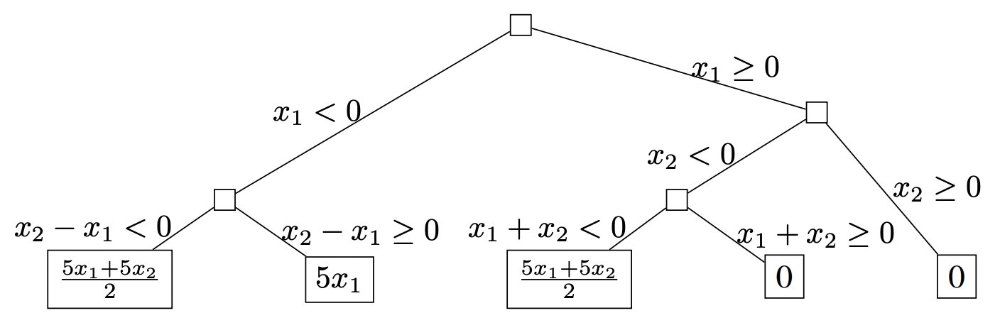
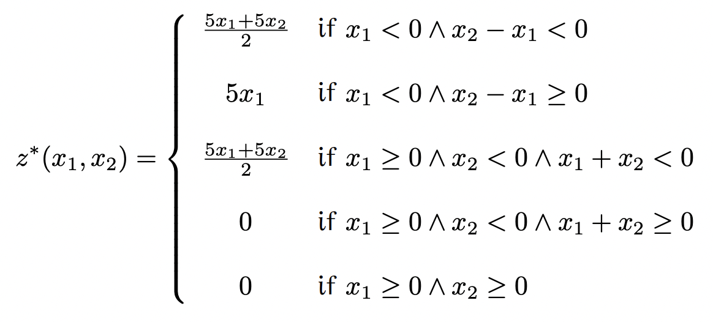
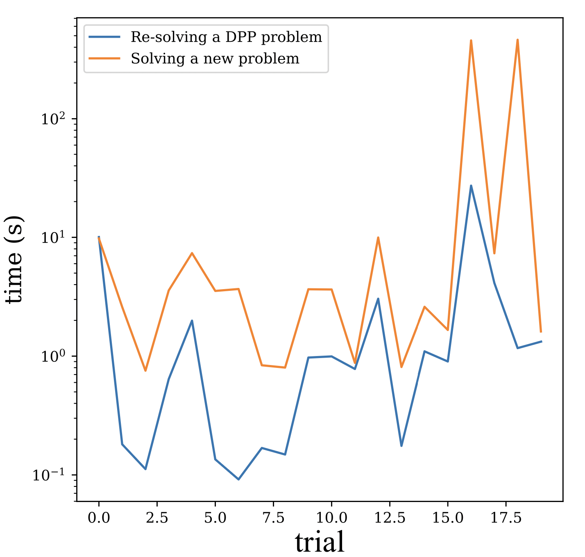

- [Parametric Integer Programming](#parametric-integer-programming)
- [Use case](#use-case)
- [Dependencies](#dependencies)
- [Bibliography](#bibliography)
- [Disclaimer](#disclaimer)

# Parametric Integer Programming

This is a minimum working example
of [Parametric Integer Programming](https://en.wikipedia.org/wiki/Parametric_programming)[^1],
a means to solving [Integer Linear Programs](https://en.wikipedia.org/wiki/Integer_programming) (ILPs) with parameters
$\theta$ in either the objective or the right-hand sides of the constraints (through duality).

$$ \begin{aligned}
J^{*}(\theta )=&\min _{x\in \mathbb {R} ^{n}}f(x,\theta )\\
&{\text{subject to }}g(x,\theta )\leq 0.\\
&\theta \in \Theta \subset \mathbb {R} ^{m}
\end{aligned} $$

The principal idea is to run a simplex solver but *symbolically*, i.e.,
leave the parameters unevaluated until the pivot step, at which point you branch depending on the sign of the
coefficient (and already explored branches).
The solution is then a piecewise affine function of the parameters.

[For example](https://github.com/makslevental/pip/blob/da0eff59b532fc2d1d0094b45f262f45b6cb4732/tests.py#L154), the
system

$$ \begin{aligned}
& \text{minimize}_{\lambda_1, \lambda_2} && z = x_1\lambda_1 + x_2\lambda_2 \\
& \text{subject to} && \lambda_1 + \lambda_2 \leq 5 \\
& && -\lambda_1 \leq 1 \\
& && -\lambda_2 \leq 2 \\
& && -\lambda_1 + \lambda_2 \leq 0 \\
& && \lambda_1, \lambda_2 \succcurlyeq 0 \\
& \text{and} && \boldsymbol {\lambda}, \mathbf {x} \in \mathbb {Z} ^{n},\end{aligned} $$

induces the following tree structure

  

and produces the following solution

  

Images from [^2].

# Use case

What's a use-case for this technique? Suppose you have a Deep Neural Network (DNN), for which you'd like to statically 
plan memory allocations (for the intermediate tensors produced during a forward pass of the DNN).
This is an instance of [Dynamic Storage Allocation](https://epubs.siam.org/doi/abs/10.1137/S0097539703423941):

$$ \begin{align}
\min\\; & \mathtt{totalmem}\\
\text{s.t.}\\; & \mathtt{offset}_i+\mathtt{mem}_i\leq\mathtt{totalmem}
\end{align} $$

where tensors $\mathtt{mem}_i$ with overlapping life-times are constrained to be ordered in the address space by

$$ \begin{align}
 & \mathtt{offset}_i + \mathtt{mem}_i \leq \mathtt{offset}_j + z\_{ij} * \mathtt{totalmem} \\
 & \mathtt{offset}_j + \mathtt{mem}_j\leq\mathtt{offset}_i + \left(1-{z\_{ij}}\right)*\mathtt{totalmem}
\end{align} $$

where $z_{ij}$ are decision variables defined

$$ z_{ij} :=  \begin{cases}
0 & \text{if }\mathtt{offset}_i + \mathtt{mem}_i\leq\mathtt{offset}_j\\
1 & \text{if }\mathtt{offset}_j + \mathtt{mem}_j\leq\mathtt{offset}_i
\end{cases} $$

This is clearly an Integer Linear Program (ILP).
You can indeed solve this for every single instance using any ILP solver (at inference time, by running a profiling pass first).
If you have algebraic relationships between the inputs and outputs of every layer of the DNN, i.e.  

$$ \mathtt{mem}_i \equiv k_i\times \alpha\cdot\beta\cdot\gamma $$

for some $\alpha\,\beta\,\gamma$ (functions in DNN input sizes), then your ILP becomes a Parametric Integer Linear Program (PILP):

$$ \begin{align}
\mathtt{mem}_i^{'} & :=\frac{\mathtt{mem}_i}{\alpha*\beta*\gamma}=k_i\\
\mathtt{offset}_i^{'} & :=\frac{\mathtt{offset}_i}{\alpha*\beta*\gamma}\\
\mathtt{totalmem}^{'} & :=\frac{\mathtt{totalmem}}{\alpha*\beta*\gamma}
\end{align} $$

where the decision variables $z_{ij}^{'}$ are redefined to become

$$ z_{ij}^{'}:=  \begin{cases}
0 & \text{if }\mathtt{offset}^{'}_i+\mathtt{mem}_i^{'}\leq\mathtt{offset}_j^{'}\\
1 & \text{if }\mathtt{offset}^{'}_j+\mathtt{mem}_j^{'}\leq\mathtt{offset}_i^{'}
\end{cases} $$

Using such a formulation, you can (potentially) speed up solving the ILP, thereby enabling optimal static memory allocation, at runtime.
[For example](https://github.com/makslevental/pip/blob/0ec1bd117f4de615680ae93efa94f808da08d584/shapes/tests.py#L86), using a related, but less powerful, technique called [Disciplined Parametric Programming](https://www.cvxpy.org/tutorial/advanced/index.html#dpp), 
for ResNet18, we see as much as a 10x speed up:

  

# Dependencies

Besides the dependencies listed in [requirements.txt](requirements.txt), you will, at minimum, need a free license for 
[Wolfram Engine](https://wolfram.com/engine/free-license).
A license for [Gurobi](https://www.gurobi.com/downloads/licenses/) is also recommended; be sure to set `GRB_LICENSE_FILE=<PATH>/gurobi.lic` 
in the env variables.

# Disclaimer

This repo is purely for illustration and experimentation. The code is guaranteed to be neither correct nor fast nor original
i.e., it has, in fact, been cobbled together from various sources.
Maybe one day it'll be something...

# Bibliography

[^1]: [Parametric integer programming 1988 by Paul Feautrier](http://www.numdam.org/item/RO_1988__22_3_243_0.pdf)
[^2]: [Section 5.1 of New Algorithmics for Polyhedral Calculus via Parametric Linear Programming by Alexandre Maréchal](https://hal.archives-ouvertes.fr/tel-01695086v3/document) (this is the best gentle introduction to the ideas)
[^3]: [FPL: A Fast Presburger Library](https://grosser.science/FPL)
